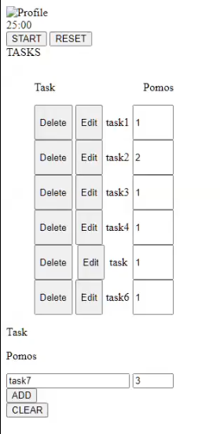
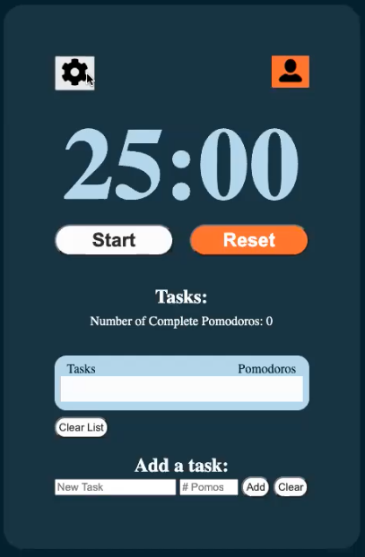
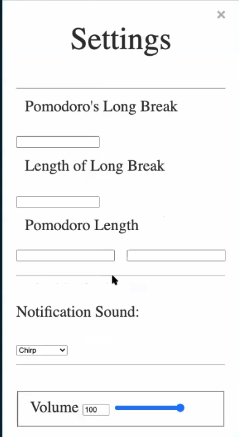
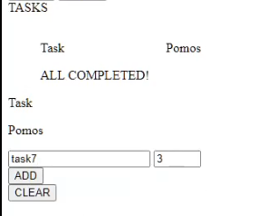
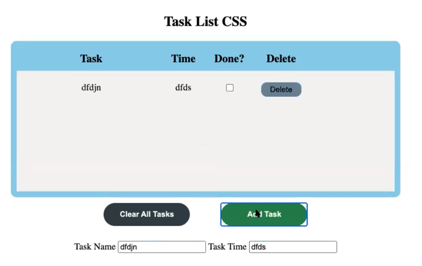
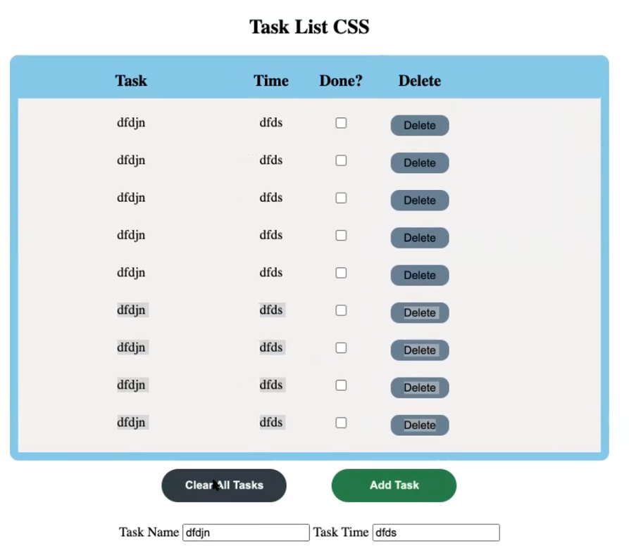
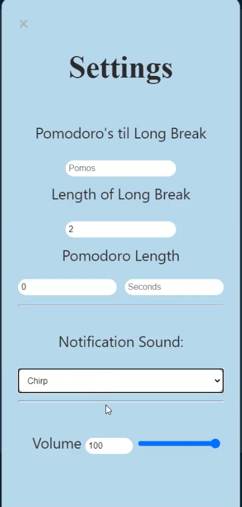
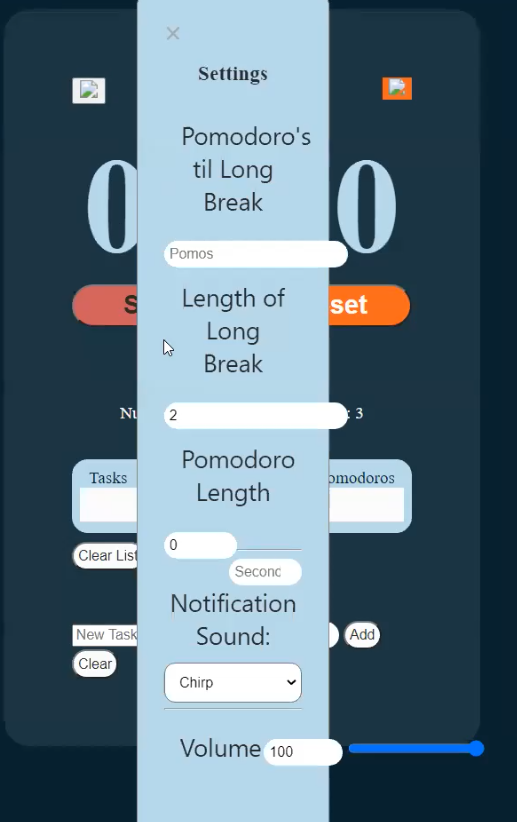
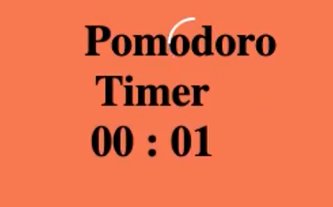

# Meeting Outline

## Sprint Review Meeting

Since it has been two weeks since we started this sprint, this will be our official sprint review meeting as well.
We will be doing almost everything we normally do, but we want to kind of wrap up the sprint, document the work we have done so far, and discuss the progress we’ve made.
First, let’s share our progress on last week’s tasks

### Review our work

- First let’s take some time to review what we all did over the last week. Some key details we should each include are:
- What you did
  - Present what you were able to work on! Feel free to share your screen and go into as much detail as you’d like.
  - Summary / Takeaways of your work
  - What you felt you did well / What you struggled with
  - Was this too much work? Not very much?
  - Whether you want to do the same type of thing going forward or try something else out
- We can contribute popcorn style

## Updating our product backlog

- What do we have to do?
- Can do this through our miro board
- Let’s make a list of all the things we need to do before our project is complete
- https://miro.com/app/board/o9J_lXnLcSQ=/
- A looser format for what we’re working on. Instead of our separate tasks where we each come back after a week with our own code, we need a more Agile format for proceeding with our work.
- Product backlog where

# Meeting Notes

## Attendance

- Took place at 4 PM on 02/21/21 through Zoom
- Everyone attended the meeting

## Review our work

- Jamie
- Ashley
  - 
  - Have task-list.js which is a custom element
  - Didn’t style anything
  - Used a web component
- Arela
  - 
  - 
  - Worked on the settings menu
  - Already had volume and custom sound working
  - Had timer editing functions
    - Had issues with
  - How many pomodoro’s before you get a long break
  - Can play with length of the long break
  - Did mostly javascript for it
  - Not sure about how to combine her component with other people’s
  - Might make it into a custom element
  - Had to edit the settings as well
  - Since used same tags as Jonathan
- Dhanush
  - Worked on Pipeline documentation
  - Checked in with Jonathan, Haley, and Arela
  - Main thing that people will be working with is Jest
  - The tutorial is pretty good
- Ivan
  - 
  - Worked on task list logic with Ashley
  - Each task has a delete and edit button
  - Can also edit the pomodoro number
  - Ran into a few problems, where adding a task wouldn’t add a task item
  - Could’ve done more
  - Had more key shortcuts
  - Just used an HTML unordered list rather than a grid or table
- Haley
  - 
  - 
  - Worked on the task list design
  - Used a nest grid to build it
  - Works with what Ivan and Ashley created pretty easily
  - Made sure that the box appeared even if there aren’t any tasks in it
  - Had a hard time with changing sizes
  - Made some nice edits to the buttons
  - Basically can copy the structure of Ivan and Haley’s
  - Should work as a subcomponent
- Jonathan
  - 
  - 
  - Worked on the timer
  - Had a lot of the same work as Arela
  - Tried to turn it into a flexbox
  - Flexbox wasn’t working
  - Added text into the input fields to show user what they’re used for
  - Did most of work in html and CSS
  - Most of his task was CSS so easy to implement
  - Mostly just working off of her code
  - Had some different tags on what she did
  - Tried to make the settings as modular as possible while working with Arela’s HTML code
- Brian
  - 
  - Mainly working on the visuals for the timer
  - Worked on getting a rotated timer visual
  - Need to link it to the timer
  - Need to link it to the overall HTML structure
  - Not too much done over this week, different issues
  - Figuring out how to get a reusable structure with what we’re doing
  - CSS didn’t transfer well across the code
  - Trying to get good tags across what everyone is doing
  - Invisible tags for stuff

## Making some structural decision

- Jonathan ended up using mostly straight HTML and didn’t try flexbox yet. Didn’t know capabilities of Grid
  - Can rip the HTML and CSS out, and a little of the JS
- Haley started looking into flexbox first, but multiple boxes gets tricky. Switched to Grid because easier to format dimensions
- Current prototype using Grid should be good
- Ashley thinks grid could fit nicely
  - two files, one for element one for the buttons (add task, clear all)
- Ivan thinks transitioning to grid could be complicated
- Brian doesn’t think his prototype would play nicely with other people’s prototypes
  - Has some custom functions
  - Custom CSS didn’t work well with it
- Arela thought that Brian’s timer was easy to mix with custom functions and javascript
  - Didn’t use custom elements, just pure javascript
  - If we brought in the stuff with the timer, also bring in the modal thing
  - Or work off someone else’s settings
  - Wouldn’t necessarily need a custom element for the HTML element and javascript
- Modal is in HTML

- See what works, merge things together and
- Pair up the task list logic and design and merge their work together
- Same thing with the timer and settings people

- Haley - down to group the tasklist and the timer/settings/visual
- Arela - figure out which main page to go off of
- Ashley - Grouping people together sounds good. What will be the actual HTML structure? Too many versions at the moment
- Brian - styling the buttons and task list. Main page soft color type of thing. Deciding on what types of buttons to do. Vote on the styles of each element.
- Ivan - Not much to say that splitting up the tasks into two makes sense. If anyone needs the colors from his design, he has them
- Jonathan - Not much to add

- codeshare.io

## Figuring out main visual design

- Timer design - Standard design
  - Brian willing to do anything
  - Jonathan probably the countdown timer, stick with Ivan’s design
  - Haley wants to just get the first iteration done, using Ivan’s basic one
  - Ashley keep it simple and get something that works, standard timer
  - Arela stick with standard one, maybe go for circle first
  - Ivan stick with standard, but really like the circle on if we can get it animated or changing the colors over time
- Task list - Haley design
- Buttons - Rounded
  - Ivan could make custom buttons, stick with rounded
- Color scheme - Dark blue, Ivan will put them in chat
  - Dhanush dark blue
  - Jamie pink design of Arela
  - Ashley preferred the lighter design
  - Haley preferred the light blue design
  - Jonathan liked dark blue, and orange good. Maybe change red and green shade. Maybe a bit lighter in the design
  - Arela prefer the dark blue one. Like the colors
  - Brian prefer the pale color one. The task list to be like the white list on the left.
  - Ivan, mostly light versus dark, but prefer the dark blue

## Updating our project backlog

- Didn't do the miro board as planned. Instead extensively talked through our next steps as recorded above.
- We will be proceeding by combining the work of Brian, Arela, and Jonathan into a main page, and then adding the task list component that Ashley, Ivan, and Haley worked on into the page.
- This will divide the group into two parts.
- Dhanush will supervise and manage the logistics for Ashley, Ivan, and Haly
- Jamie will supervise and manage the logistics for Brian, Arela, and Jonathan

## Team Status Video

- Left unaddressed in the meeting
- Recorded the review in order to take clips for the team status video
- Will be Jamie and Dhanush's responsibility
