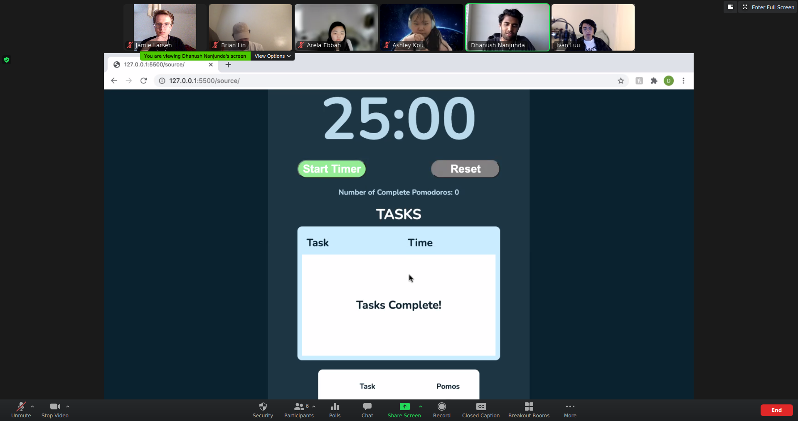
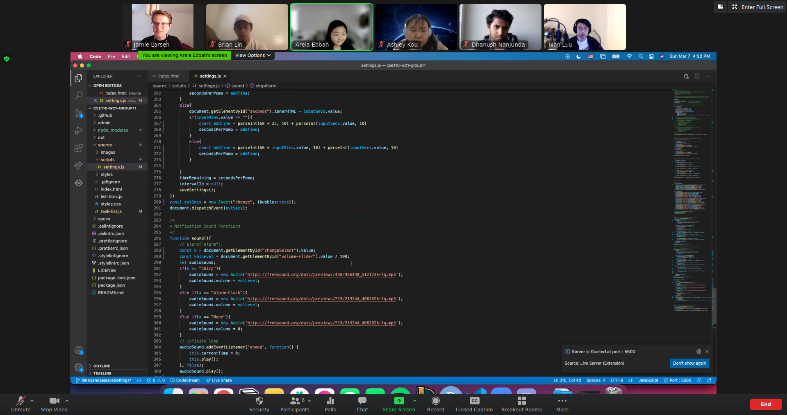
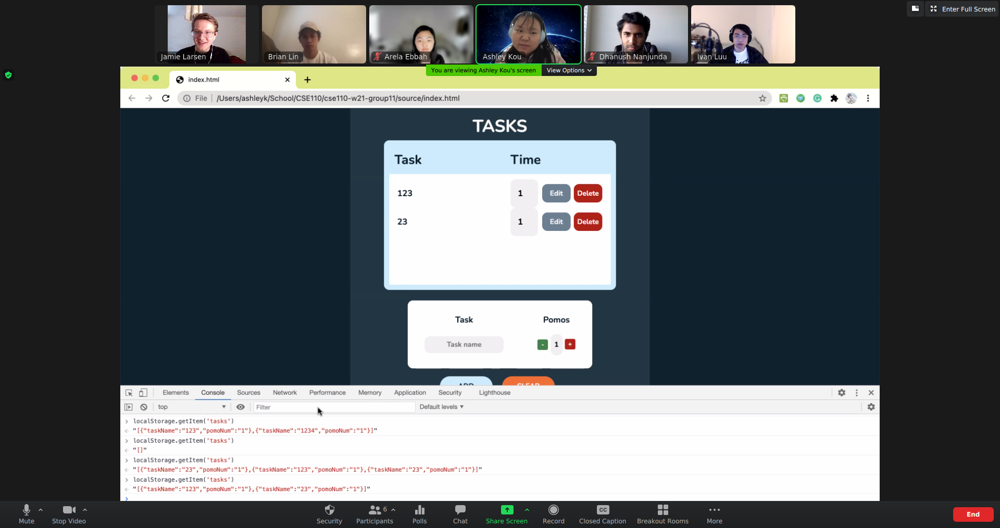
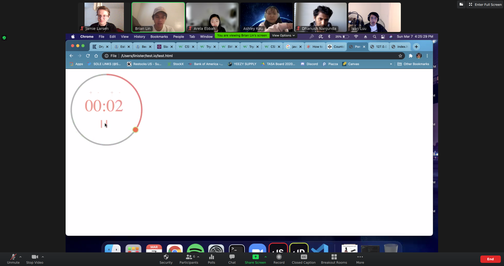
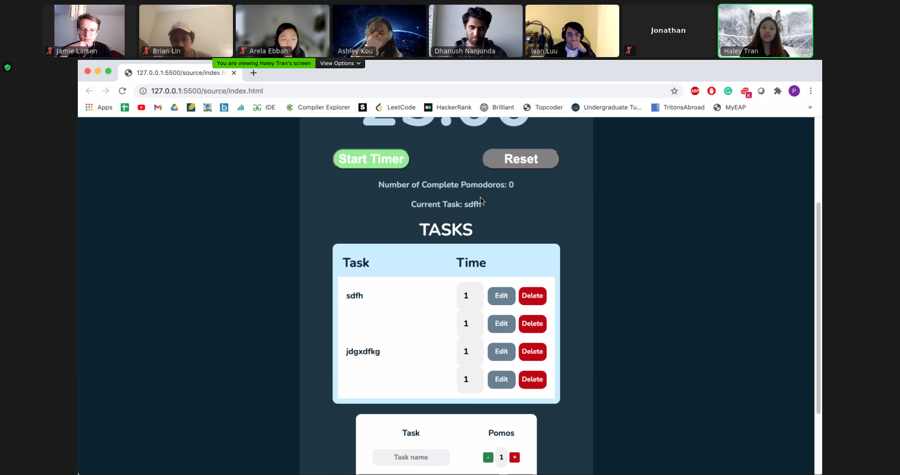
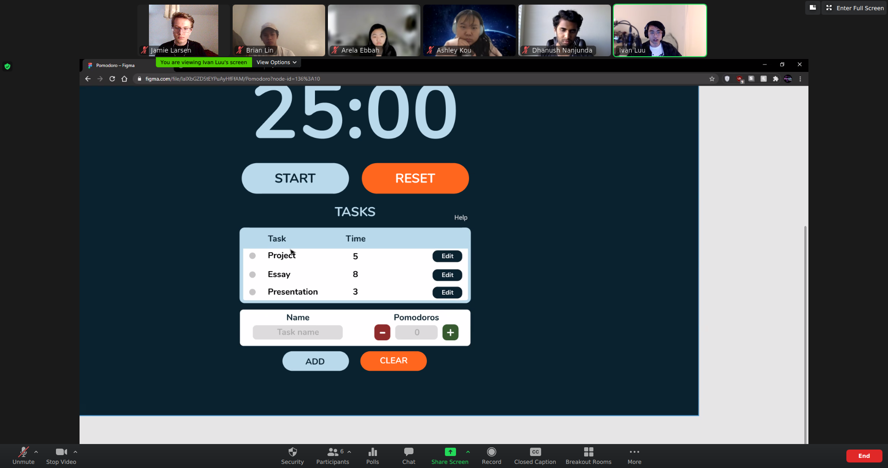
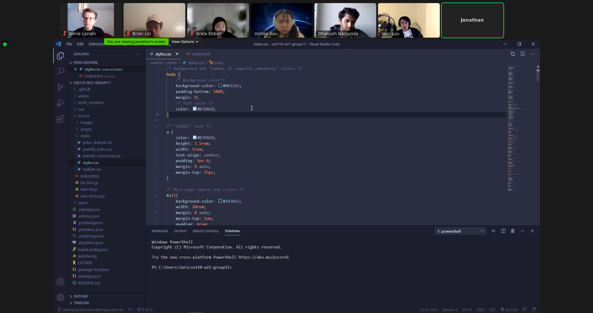

# Meeting Outline

## Sprint Review Meeting

- Since it has been two weeks since we started this sprint, this will be our official sprint review meeting
- We will be doing almost everything we normally do, but we want to kind of wrap up the sprint, document the work we have done so far, and discuss the progress we’ve made.
- First, let’s share our progress on last week’s tasks
- We’ll be taking screenshots as people share their work for the sprint review assignment

### Review our work

- First let’s take some time to review what we all did over the last week. Some key details we should each include are:
- What you did
  - Present what you were able to work on! Feel free to share your screen and go into as much detail as you’d like.
  - Summary / Takeaways of your work
  - What you felt you did well / What you struggled with
  - Was this too much work? Not very much?
  - Whether you want to do the same type of thing going forward or try something else out
- We can contribute popcorn style

### Merging our work into a single branch

- Has everyone merged main into their branch?
- If you are ready to merge you code, make a PR for it and we will go in order
- Decide the order depending on people’s progress and who’s ready to merge

### Updating our product backlog

- Let’s check off what we’ve completed in Github Issues
- Let’s reevaluate any bugs that exist
- Let’s examine what we need to do for the statistic tracking to get it functional

## Sprint Retrospective

- Now or on Tuesday?

# Meeting Notes

## Attendance

- Took place at 4 PM on 03/07/21 through Zoom
- Haley and Jonathan were late, they arrived around 5 PM

## Review our work

- Jamie
  - Worked on fixing the code for pomo breaks logic, which works fine now
  - Worked on pipeline, because Jest was not working
  - Got most of it done
  - Wrote tests for settings.js and they are pretty comprehensive
  - Added some documentation
- Dhanush
  - 
  - Worked on getting code into the main branch. Need to scroll down to see the task list
  - Worked on writing tests for the task list, not quite done yet
- Arela
  - 
  - Worked on saving the settings in local storage
  - Pulls values whenever the website loads
  - Also made a max time length of 120 minutes
  - Caps out when enter is pressed or menu exited
  - Could also make seconds cap at 0 when 120 minutes is chosen
- Ashley
  - 
  - Worked on saving the tasks to local storage
  - Looks to correctly store things in local storage
  - Even works for tasks with duplicated names
  - Even keeps things in order
- Brian
  - 
  - Worked on animation for timer
  - Adjusts animation if pomo length is changed
  - Needs to work on putting it within our app
- Haley
  - 
  - Added local storage for incompleted tasks as well, and for completed tasks
  - Added way to track what task is being worked on
  - Should be easy to make the task move to the completed list
- Ivan
  - 
  - First worked on the figma design, how to put in the task selection
  - Liked the checkbox next to tasks ideas
  - Thinks we should take away the delete button until edit is pressed
  - Should prompt the user to select a task
  - Could be cool to have tabs to indicate which tasks you’re working on
  - Fixed up some of the CSS cleaner
  - Also fixed up some of the task list code, no duplicate event listener for the keypress
  - Changed some colors around, removed the background
  - Left settings untouched cause Jonathan working on it
  - Added stats button
  - Issue with the timer
  - Added highlighting and hover
- Jonathan
  - 
  - Worked on settings alignment
  - Done for the most part, just needs to fix a few things that are thrown off in mobile display
  - Mostly finished issues with the javascript

## Sprint Retrospective

- We will do it on Tuesday
